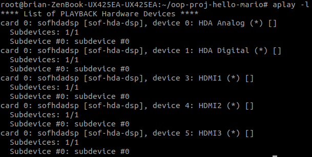

# Game Demo


# Requirements
You must have a **Docker Hub account** to build docker image and run the game.

# Use Docker As Root
First open the terminal and type
```
$ sudo groupadd -f docker
```
Then type the following usermod command to add the active user to the **docker** group
```
$ sudo usermod -aG docker $USER
```
Apply the group changes to the current terminal session by typing
```
$ newgrp docker
```
Finally check if the **docker** group is in the list of user groups
```
$ groups
```

# How to run the game
首先進入repo
```
$ cd oop-proj-survive
```
然後把docker build起來並進入docker
```
$ source Docker/build.sh
```
過程中若出現需要docker login，請使用自己的Docker Hub account登入

完成後再執行
```
$ source Docker/docker_run.sh 或 $ ./docker_run
```
若docker已在執行中請使用
```
$ source Docker/docker_join.sh 或 $ ./docker_join
```
進入docker後輸入下列指令即可進入遊戲:
```
# python3 main.py
```
若出現ALSA相關問題表示音訊設定錯誤，可嘗試輸入
```
# aplay -l
```
看是否有正確安裝並識別音訊設備

若音訊設備已正確安裝並被偵測到，輸入
```
# export AUDIODEV=hw:(#card_number),(#device_number)
```
其中hw:後面的數字代表使用第(#card_number)張卡的第(#device_number)個設備

需要依據前面`aplay -l`列出的結果來選擇

例如以下：



圖中HDA Analog為筆電喇叭，則指令須輸入
```
# export AUDIODEV=hw:0,0
```

輸入完成後，可以輸入以下指令來測試是否設定成功
```
# speaker-test -D hw:(#card_number),(#device_number) -t wav -c 2
```
有聲音的話表示音訊設備設定成功，就可以ctrl-c結束並執行遊戲
```
# python3 main.py
```