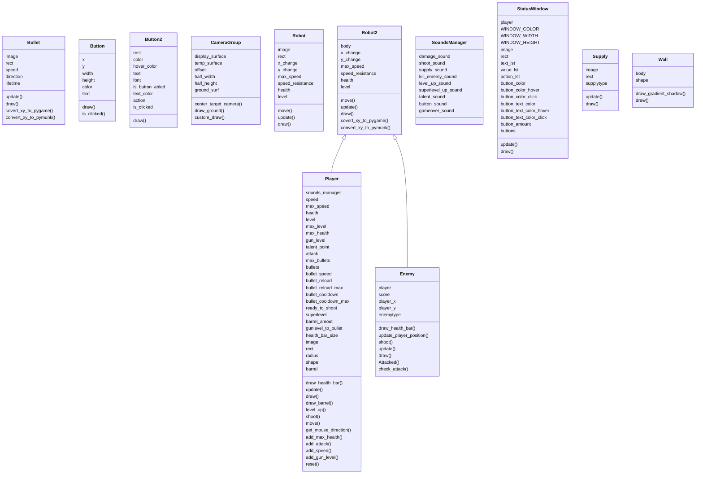

```mermaid
classDiagram
    class Bullet {
        image
        rect
        speed
        direction
        lifetime
        update()
        draw()
        covert_xy_to_pygame()
        convert_xy_to_pymunk()
    }
    class Button {
        x
        y
        width
        height
        color
        text
        draw()
        is_clicked()
    }
    class Button2 {
        rect
        color
        hover_color
        text
        font
        is_button_abled
        text_color
        action
        is_clicked
        draw()
    }
    class CameraGroup {
        display_surface
        temp_surface
        offset
        half_width
        half_height
        ground_surf
        center_target_camera()
        draw_ground()
        custom_draw()
    }
    class Enemy {
        player
        score
        player_x
        player_y
        enemytype
        draw_health_bar()
        update_player_position()
        shoot()
        update()
        draw()
        Attacked()
        check_attack()
    }
    class Player {
        sounds_manager
        speed
        max_speed
        health
        level
        max_level
        max_health
        gun_level
        talent_point
        attack
        max_bullets
        bullets
        bullet_speed
        bullet_reload
        bullet_reload_max
        bullet_cooldown
        bullet_cooldown_max
        ready_to_shoot
        superlevel
        barrel_amout
        gunlevel_to_bullet
        health_bar_size
        image
        rect
        radius
        shape
        barrel
        draw_health_bar()
        update()
        draw()
        draw_barrel()
        level_up()
        shoot()
        move()
        get_mouse_direction()
        add_max_health()
        add_attack()
        add_speed()
        add_gun_level()
        reset()
    }
    class Robot{
        image
        rect
        x_change
        y_change
        max_speed
        speed_resistance
        health
        level
        move()
        update()
        draw()
    }
    class Robot2{
        body
        x_change
        y_change
        max_speed
        speed_resistance
        health
        level
        move()
        update()
        draw()
        covert_xy_to_pygame()
        convert_xy_to_pymunk()
    }
    class SoundsManager{
        damage_sound
        shoot_sound
        supply_sound
        kill_ememy_sound
        level_up_sound
        superlevel_up_sound
        talent_sound
        button_sound
        gameover_sound
    }
    class StatusWindow{
        player
        WINDOW_COLOR
        WINDOW_WIDTH
        WINDOW_HEIGHT
        image
        rect
        text_lst
        value_lst
        action_lst
        button_color
        button_color_hover
        button_color_click
        button_text_color
        button_text_color_hover
        button_text_color_click
        button_amount
        buttons
        update()
        draw()
    }
    class Supply{
        image
        rect
        supplytype
        update()
        draw()
    }
    class Wall{
        body
        shape
        draw_gradient_shadow()
        draw()
    }
     Robot2 <|-- Player
     Robot2 <|-- Enemy
```
